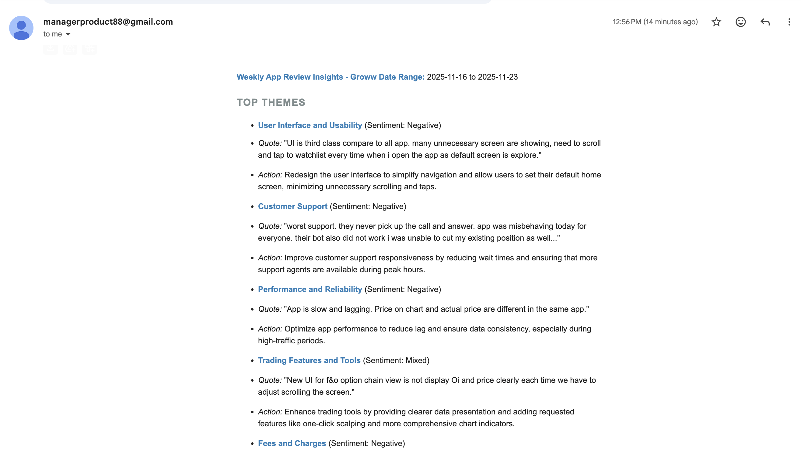
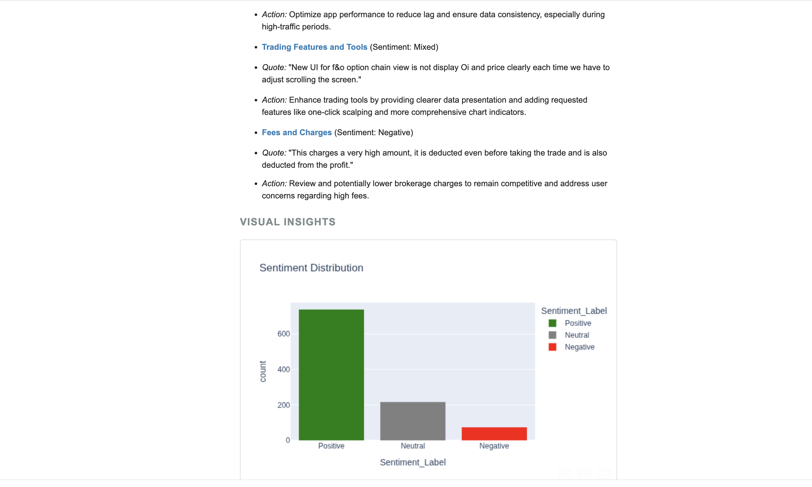
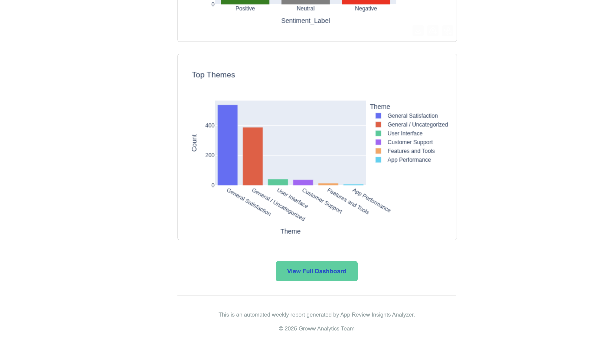

# App Review Insights Analyzer

This tool analyzes Google Play Store reviews for the Groww app, extracts themes using clustering, and generates a weekly insights report with an email draft.

## Features
- **Data Processing**: Cleans and filters reviews for the last 8-12 weeks.
- **Theme Extraction**: Uses TF-IDF and K-Means clustering to identify top 5 themes.
- **Sentiment Analysis**: Classifies reviews as Positive, Negative, or Neutral.
- **Insights Generation**: Produces a concise weekly note with top themes, user quotes, and action ideas.
- **Email Drafting**: Automatically formats the report into an email draft.

## Setup

1. **Prerequisites**: Python 3.8+
2. **Install Dependencies**:
   ```bash
   pip install -r requirements.txt
   ```
3. **Data**: Ensure `groww_reviews.json` is in the project root.

## Running the App

Run the Streamlit app:
```bash
streamlit run app.py
```

## Usage
1. Adjust the "Weeks to Analyze" slider to filter data.
2. View the Dashboard for high-level metrics.
3. Click **"Generate Weekly Report"** to see the insights and email draft.
4. Copy the email draft or download the report.

## Project Structure
- `app.py`: Main Streamlit application.
- `processor.py`: Data loading, cleaning, clustering, and sentiment analysis.
- `insights.py`: Logic for generating themes, quotes, and action ideas.
- `mailer.py`: Email draft formatting.
- `groww_reviews.json`: Dataset.


# Latest mail screenshot




